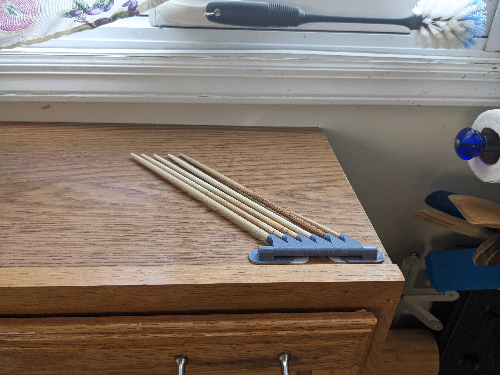

# Baggie Drying Tree




STL's for printing are in [releases](../../releases)  
[thingiverse](https://www.thingiverse.com/thing:5338698)

Uses 6mm diameter chopsticks, or you can set ```sd = 5;``` for 5mm diameter chopsticks, or 3 for 3mm diameter skewers, or whatever diameter your sticks are.

Fits small size Command(tm) refills for sticking to the wall or cabinet or fridge etc.
